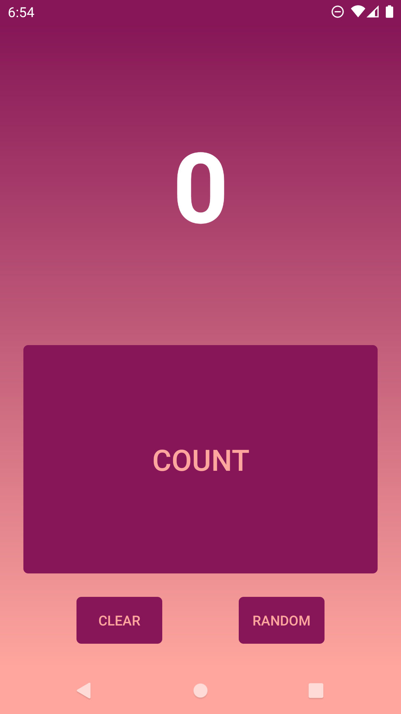
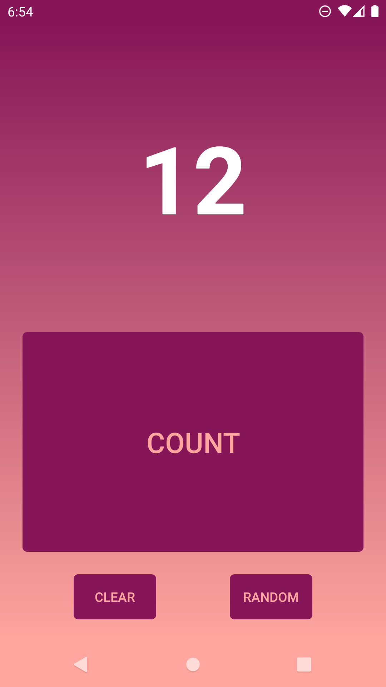

# Conpi

Counter app with random number generator. 

	
	
	

# Vide demo

[Watch demo on youtube](https://youtu.be/zfJPMUP24mk)

# Features

- increase the counter by one after each click
- counter with animation
- counter with vibration feedback
- clear counter
- generate random number from 0 up to (including) the counter value
