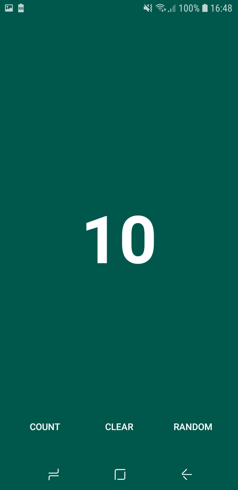
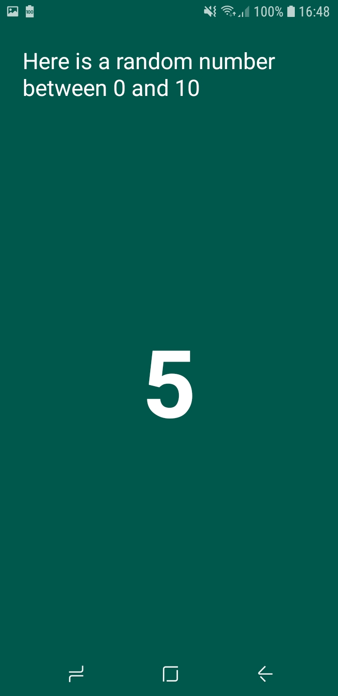

# Counter with random number generator

Android app made to exercise the usage of kotlin

	
	

# Features

- increate the counter by one after each click
- clear counter
- generate random number from 0 up to (including) the counter value